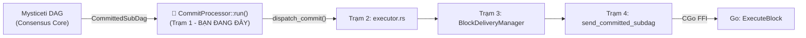
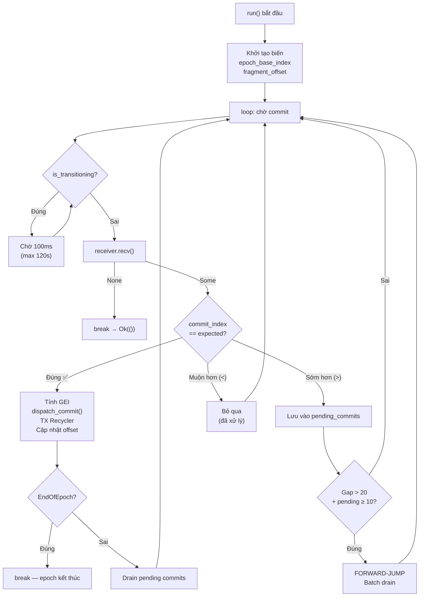

# Giải Thích Chi Tiết Hàm `CommitProcessor::run()`

> [!IMPORTANT]
> **Đúng rồi!** Hàm `run()` chính là **Trạm 1 (Station 1)** trong pipeline xử lý **hậu đồng thuận DAG**. Nó nhận kết quả từ lõi consensus Mysticeti DAG (các `CommittedSubDag`) và đảm bảo chúng được xử lý **đúng thứ tự** trước khi gửi xuống Go để thực thi.

---

## Vị Trí Trong Kiến Trúc



---

## Giải Thích Từng Dòng Code

### PHẦN 1: Khởi Tạo Biến (Dòng 242–251)

```rust
let mut receiver = self.receiver;                           // L243
let mut next_expected_index = self.next_expected_index;     // L244
let mut pending_commits = self.pending_commits;             // L245
let commit_index_callback = self.commit_index_callback;     // L246
let current_epoch = self.current_epoch;                     // L247
let executor_client = self.executor_client;                 // L248
let delivery_sender = self.delivery_sender;                 // L249
let pending_transactions_queue = self.pending_transactions_queue; // L250
let epoch_transition_callback = self.epoch_transition_callback;   // L251
```

**Giải thích:** Hàm `run(self)` consume `self` (lấy ownership), nên nó **move** tất cả các field ra thành biến local. Điều này vì Rust ownership — bạn không thể borrow `self` lâu dài trong async loop.

| Biến | Vai trò |
|------|---------|
| `receiver` | Channel nhận `CommittedSubDag` từ consensus core |
| `next_expected_index` | Commit index tiếp theo cần xử lý (bắt đầu từ 1) |
| `pending_commits` | BTreeMap chứa commit đến lệch thứ tự, chờ xử lý sau |
| `commit_index_callback` | Callback thông báo commit index đã xử lý xong |
| `current_epoch` | Epoch hiện tại (dùng tính GEI) |
| `executor_client` | Client gRPC/FFI gửi block sang Go |
| `delivery_sender` | Channel gửi `ValidatedCommit` cho BlockDeliveryManager |
| `pending_transactions_queue` | Queue chứa TX cần retry khi chuyển epoch |
| `epoch_transition_callback` | Callback gọi khi phát hiện EndOfEpoch |

---

### PHẦN 2: Tính `epoch_base_index` — Fork Safety (Dòng 253–269)

```rust
let epoch_base_index = if let Some(override_val) = self.epoch_base_index_override {
    override_val                                            // L261: Ưu tiên #1
} else if let Some(ref shared_index) = self.shared_last_global_exec_index {
    let index_guard = shared_index.lock().await;
    *index_guard                                            // L264: Ưu tiên #2
} else if let Some(ref callback) = self.get_last_global_exec_index {
    callback()                                              // L266: Ưu tiên #3
} else {
    0                                                       // L268: Mặc định
};
```

> [!CAUTION]
> **FORK SAFETY CRITICAL!** Đây là phần cực kỳ quan trọng.

**`epoch_base_index`** = GEI (Global Execution Index) tại **thời điểm BẮT ĐẦU** epoch hiện tại.

Công thức GEI: `global_exec_index = epoch_base_index + commit_index + fragment_offset`

**Tại sao cần `override`?** Sau cold-start (khởi động lại node), `shared_last_global_exec_index` bị cập nhật thành giá trị mới nhất từ mạng (ví dụ: 4364). Nhưng nếu đang ở epoch 1 thì `epoch_base_index` phải là **0**, không phải 4364! Nếu dùng sai → GEI sai → hash khác node khác → **FORK** mạng!

Thứ tự ưu tiên:

1. **`epoch_base_index_override`** (set từ `with_epoch_info()`) — giá trị chính xác nhất
2. **`shared_last_global_exec_index`** — fallback từ shared state
3. **Callback** — hiện không dùng nữa
4. **0** — default cho epoch đầu tiên

---

### PHẦN 3: Heartbeat + LagMonitor (Dòng 273–295)

```rust
let mut last_heartbeat_commit = 0u32;                       // L273
let mut last_heartbeat_time = std::time::Instant::now();    // L274
const HEARTBEAT_INTERVAL: u32 = 1000;                      // L275
const HEARTBEAT_TIMEOUT_SECS: u64 = 300;                   // L276
```

Mỗi **1000 commit** in ra một log heartbeat (`💓`). Nếu **5 phút** (300s) không có commit mới → cảnh báo processor có thể bị **stuck**.

```rust
// Spawn LagMonitor (L279-293)
if let (Some(client), Some(shared_gei), Some(sender)) = (...) {
    let lag_monitor = LagMonitor::new(client, shared_gei, sender);
    tokio::spawn(async move { lag_monitor.run().await; });
}
```

**LagMonitor**: Chạy song song, theo dõi khoảng cách (lag) giữa Rust consensus và Go execution. Nếu Go xử lý quá chậm → gửi alert.

---

### PHẦN 4: Tính `cumulative_fragment_offset` — Crash Recovery (Dòng 297–338)

```rust
// Tính toán bằng toán (L306-316)
let math_offset = if let Some(ref shared_idx) = self.shared_last_global_exec_index {
    let last_gei = *shared_idx.lock().await;
    let expected = (next_expected_index - 1) as u64;
    if last_gei > epoch_base_index + expected {
        last_gei - epoch_base_index - expected  // "Dư" ra bao nhiêu GEI
    } else { 0 }
} else { 0 };

// Ưu tiên load từ đĩa, fallback sang math (L318-337)
let mut cumulative_fragment_offset = if let Some(ref sp) = self.storage_path {
    let loaded = persistence::load_fragment_offset(sp);
    if loaded == 0 && math_offset > 0 { math_offset }      // Snapshot restore
    else if loaded > 0 { loaded }                           // Có trên đĩa
    else { 0 }
} else { math_offset };
```

**Fragmentation là gì?** Khi 1 commit có quá nhiều TX (12K+), nó bị **chặt nhỏ** thành N fragment gửi cho Go. Mỗi fragment tiêu thụ 1 GEI. Nếu commit 5 bị chặt thành 3 fragment → tiêu thụ 3 GEI thay vì 1 → offset tăng thêm 2.

**Crash recovery:** Offset được lưu trên đĩa. Nếu bị wipe (snapshot restore) thì tính lại bằng công thức toán: `offset = last_gei - epoch_base - (next_expected - 1)`.

---

### PHẦN 5: Vòng Lặp Chính — `loop` (Dòng 340+)

#### 5A. Kiểm Tra Epoch Transition (Dòng 341–368)

```rust
if let Some(ref is_transitioning) = self.is_transitioning {
    while is_transitioning.load(Ordering::Acquire) {        // L347
        // LOG + CHỜ 100ms mỗi vòng
        tokio::time::sleep(Duration::from_millis(100)).await; // L363

        // SAFETY: Nếu chờ > 120s → force clear flag              
        if elapsed > 120s { is_transitioning.store(false); break; } // L356-361
    }
}
```

> [!WARNING]
> **CRITICAL DEFENSE!** Khi đang chuyển epoch, Go Master đang re-initialize. Nếu Rust tiếp tục gửi commit mới → Go bị **nghẹn**. Nên processor **tạm dừng** (pause) cho đến khi flag `is_transitioning` = false.
>
> Timeout 120s để tránh **deadlock vĩnh viễn** nếu flag không bao giờ được clear (do panic, task bị cancel...).

---

#### 5B. Nhận Commit Từ Channel (Dòng 370–374)

```rust
match receiver.recv().await {
    Some(subdag) => {
        let commit_index: u32 = subdag.commit_ref.index;   // L372
        // ...
    }
    None => { break; }  // Channel đóng → thoát loop (L808-811)
}
```

Đây là **blocking wait**: processor ngồi chờ consensus core nhả ra `CommittedSubDag` tiếp theo.

---

#### 5C. Heartbeat Check (Dòng 376–392)

Mỗi 1000 commit → in log `💓`. Nếu 5 phút không có progress → in cảnh báo `⚠️`.

---

#### 5D. AUTO-JUMP: Nhảy Index Khi Khởi Động (Dòng 400–407)

```rust
if next_expected_index == 1 && commit_index > 1 {
    next_expected_index = commit_index;  // Nhảy lên luôn
}
```

Khi node restart, commit đầu tiên nhận được có thể là #500 (không phải #1). Thay vì đọc DB (bị cấm), processor **auto-jump** lên commit đầu tiên mà consensus gửi.

---

#### 5E. DAG-RESET Detection (Dòng 409–425)

```rust
if commit_index < next_expected_index && gap > 100 {
    next_expected_index = commit_index;  // Nhảy XUỐNG
}
```

Ngược lại với AUTO-JUMP: Nếu DAG bị wipe (reset), nó sẽ gửi commit #1 lại nhưng processor đang chờ #939. Gap > 100 → phát hiện DAG mới → reset `next_expected_index` xuống.

---

#### 5F. Xử Lý Commit Đúng Thứ Tự (Dòng 427–552) — **PHẦN QUAN TRỌNG NHẤT**

```rust
if commit_index == next_expected_index {
```

Khi commit đến **đúng số thứ tự mong đợi**, thực hiện pipeline đầy đủ:

**Bước 1:** Tính GEI (dòng 434–438)

```rust
let global_exec_index = calculate_global_exec_index(
    current_epoch,
    commit_index as u64 + cumulative_fragment_offset,
    epoch_base_index,
);
```

**Bước 2:** Tạo `batch_id` cho tracing (dòng 441–442)

```rust
let batch_id = format!("E{}C{}G{}", current_epoch, commit_index, global_exec_index);
// Ví dụ: "E0C42G42" → Epoch 0, Commit 42, GEI 42
```

**Bước 3:** Đếm tổng TX trong commit (dòng 455–459)

```rust
let total_txs_in_commit = subdag.blocks.iter()
    .map(|b| b.transactions().len())
    .sum::<usize>();
```

**Bước 4:** 🔥 **Gọi `dispatch_commit()`** — Gửi commit cho pipeline phía dưới (dòng 463–474)

```rust
let geis_consumed = super::executor::dispatch_commit(
    &subdag, global_exec_index, current_epoch,
    executor_client.clone(), delivery_sender.clone(),
    pending_transactions_queue.clone(),
    self.epoch_eth_addresses.clone(),
    self.tx_recycler.clone(),
    self.shared_last_global_exec_index.clone(),
).await?;
```

> [!IMPORTANT]
> Đây là cuộc gọi **quan trọng nhất** của hàm. `dispatch_commit()` sẽ:
>
> 1. Xác định leader của commit (từ ETH address)
> 2. Chặt nhỏ nếu quá lớn (fragmentation)
> 3. Gửi cho BlockDeliveryManager → cuối cùng tới Go
>
> Trả về `geis_consumed`: 1 commit bình thường = 1 GEI, commit bị fragment = N GEI.

**Bước 5:** TX Recycler — Xác nhận TX đã commit (dòng 476–488)

```rust
if let Some(ref recycler) = self.tx_recycler {
    recycler.confirm_committed(&committed_tx_data).await;
}
```

Thông báo cho TxRecycler rằng các TX này đã được commit → **không re-submit** nữa.

**Bước 6:** Cập nhật callbacks + fragment offset (dòng 494–513)

```rust
// Cập nhật GEI callback
let last_gei = global_exec_index + geis_consumed - 1;
callback(last_gei);

// Cập nhật commit index callback
callback(commit_index);

// Tăng fragment offset nếu commit bị chặt nhỏ
if geis_consumed > 1 {
    cumulative_fragment_offset += geis_consumed - 1;
    persist_fragment_offset(sp, cumulative_fragment_offset).await; // Lưu đĩa
}
```

**Bước 7:** Tăng `next_expected_index` (dòng 515)

```rust
next_expected_index += 1;
```

**Bước 8:** Kiểm tra EndOfEpoch (dòng 517–552)

```rust
if let Some((_block_ref, system_tx)) = subdag.extract_end_of_epoch_transaction() {
    if let Some((new_epoch, boundary_block)) = system_tx.as_end_of_epoch() {
        // Gọi epoch transition callback
        callback(new_epoch, boundary_block, global_exec_index)?;
        
        // PHẢI BREAK! Epoch này kết thúc rồi.
        break;
    }
}
```

> [!CAUTION]
> **PHẢI `break` sau EndOfEpoch!** Nếu không break, processor sẽ tiếp tục gửi commit cũ sang Go → Go tăng GEI sai → **FORK** ở epoch mới!

---

#### 5G. Xử Lý Pending Out-of-Order Commits (Dòng 554–620)

Sau khi xử lý commit đúng thứ tự, processor kiểm tra xem có commit nào đã đến trước (lệch thứ tự) mà bây giờ đã đến lượt chưa:

```rust
while let Some(pending) = pending_commits.remove(&next_expected_index) {
    // Tính GEI → dispatch_commit() → cập nhật offset → tăng next_expected
    // Kiểm tra EndOfEpoch trong pending commit nữa!
}
```

Ví dụ: Nhận commit 5, 7, 6 → xử lý 5 → check pending → thấy 6 → xử lý 6 → thấy 7 → xử lý 7.

---

#### 5H. Commit Đến Sớm (Out-of-Order) (Dòng 621–800)

```rust
} else if commit_index > next_expected_index {
    // Buffer vào pending_commits (giới hạn 5000)
    pending_commits.insert(commit_index, subdag);
```

Commit đến **sớm hơn mong đợi** → lưu vào `BTreeMap`, chờ commit đúng thứ tự đến.

**FORWARD-JUMP Recovery** (dòng 658–798): Nếu có ≥ 10 pending commit + gap > 20 → phát hiện **snapshot restore** → nhảy lên và drain hàng đợi. Commit rỗng được **batch-skip** (không gọi `dispatch_commit()`, chỉ tăng GEI) để tối ưu performance.

---

#### 5I. Commit Đến Muộn (Đã Xử Lý Rồi) (Dòng 801–806)

```rust
} else {
    warn!("Received commit with index {} which is less than expected {}", ...);
}
```

Commit cũ (đã xử lý) → bỏ qua, chỉ log warning.

---

## Tóm Tắt Luồng Hoạt Động



---

## Các Cơ Chế An Toàn (Safety Mechanisms)

| Cơ chế | Mục đích | Dòng |
|--------|----------|------|
| **Fork Safety v3** | Dùng `epoch_base_index_override` thay vì shared state | 253–269 |
| **Epoch Transition Pause** | Dừng xử lý khi Go đang re-init | 341–368 |
| **120s Deadlock Timeout** | Force-clear flag nếu bị stuck | 356–361 |
| **AUTO-JUMP** | Nhảy lên commit đầu tiên khi restart | 400–407 |
| **DAG-RESET Detection** | Phát hiện DAG mới (gap > 100) | 409–425 |
| **Fragment Offset Persist** | Lưu offset vào đĩa cho crash recovery | 510–512 |
| **Pending Commits Cap** | Giới hạn 5000 pending → tránh OOM | 623–632 |
| **FORWARD-JUMP** | Recovery sau snapshot restore | 658–798 |
| **EndOfEpoch Break** | Dừng hoàn toàn khi epoch kết thúc | 548–550 |
| **Heartbeat + LagMonitor** | Phát hiện processor bị stuck | 273–293 |
