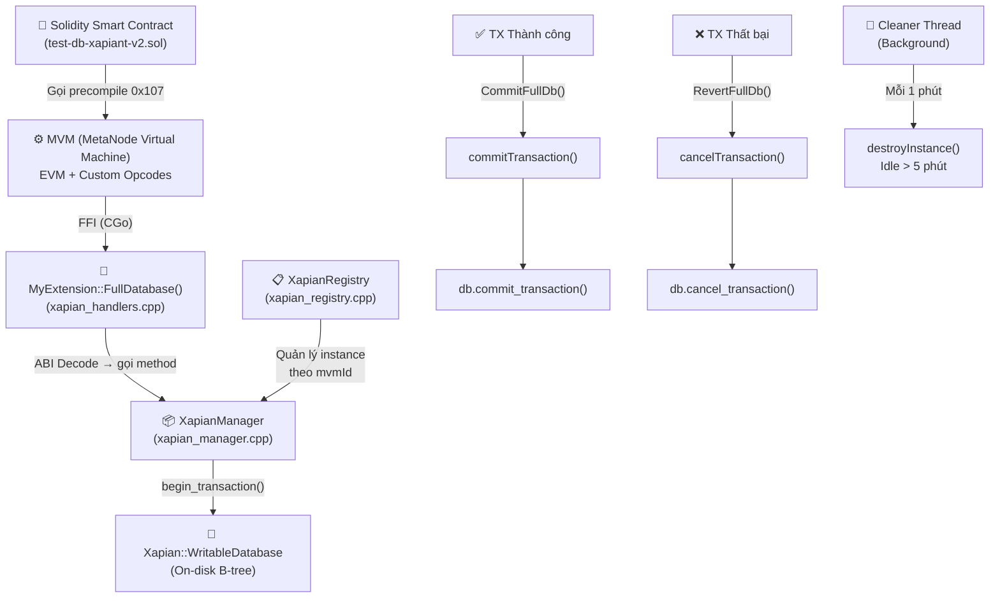
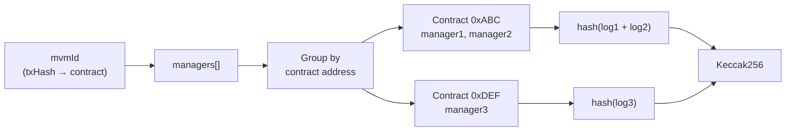
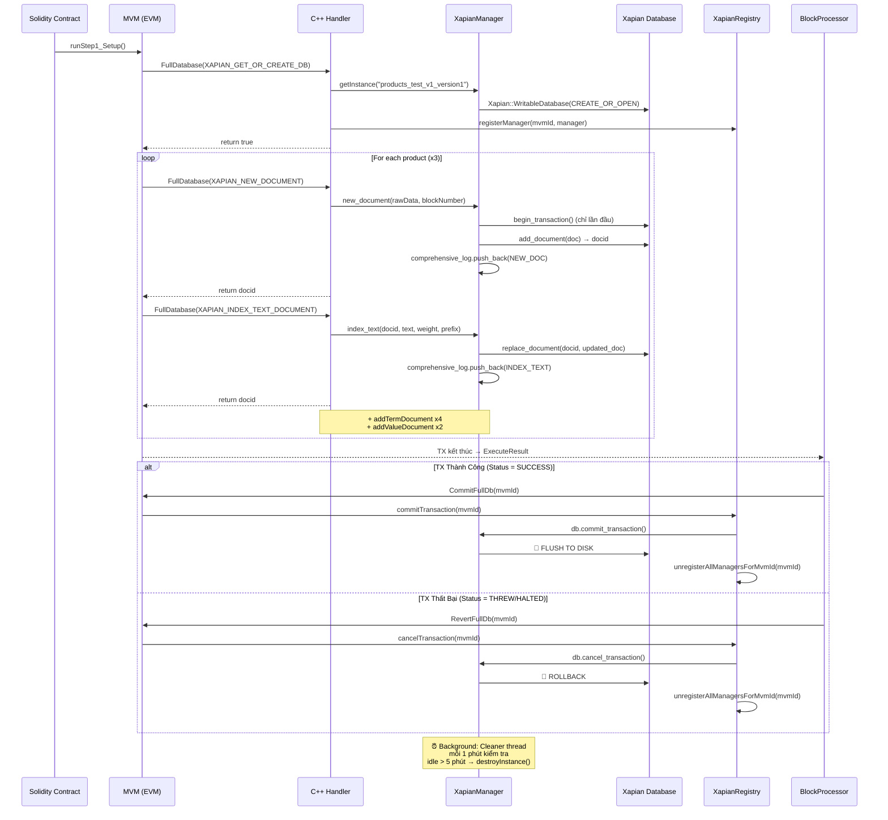

# 🔍 Vòng Đời của Xapian trong Hệ Thống Blockchain Metanode

> **Tài liệu này mô tả chi tiết từng bước** khi một giao dịch (transaction) sử dụng Xapian full-text search database: từ khi Smart Contract gọi precompile, qua lớp FFI (Go → C++), đến khi dữ liệu được commit xuống disk hoặc revert nếu giao dịch lỗi, và cuối cùng là cơ chế cleanup tự động.

---

## 📋 Tổng Quan Kiến Trúc



---

## 🚀 Phase 1: Smart Contract Khởi Tạo (Solidity)

Bắt đầu từ hàm [runStep1_Setup](file:///home/abc/nhat/con-chain-v2/metanode/execution/cmd/tool/tool-test-chain/contract/test-db-xapiant-v2.sol#L234-L241):

```solidity
// test-db-xapiant-v2.sol, line 234
function runStep1_Setup() public {
    isSetupDone = false;
    docIds[0] = 0;
    docIds[1] = 0;
    docIds[2] = 0;
    _setupInternal();   // ← Bước chính
    isSetupDone = true;
}
```

Hàm [_setupInternal](file:///home/abc/nhat/con-chain-v2/metanode/execution/cmd/tool/tool-test-chain/contract/test-db-xapiant-v2.sol#L243-L282) thực hiện 3 bước:

### Bước 1.1: Tạo/Mở Database

```solidity
// line 244
fullDB.getOrCreateDb(DB_NAME);  // DB_NAME = "products_test_v1_version1"
```

> `fullDB` là interface `IFullDBV1` trỏ đến precompile address `0x107`.
> Khi EVM gặp lệnh gọi đến address `0x107`, nó **không chạy bytecode** mà chuyển xuống **C++ handler**.

### Bước 1.2: Insert Product (3 lần)

```solidity
// line 247-256: Insert sản phẩm "iPhone 13 Pro"
docIds[0] = _insertProduct(
    P1_DATA,       // ABI-encoded ProductData struct
    P1_TEXT,       // "Iphone 13 Pro Smart phone cao cap..."
    P1_PRICE,      // "99999"
    P1_DISC,       // "84999"
    "apple",       // brand
    "electronics", // category
    "black",       // color
    "bestseller"   // filter_tag
);
```

Hàm [_insertProduct](file:///home/abc/nhat/con-chain-v2/metanode/execution/cmd/tool/tool-test-chain/contract/test-db-xapiant-v2.sol#L284-L324) gọi 6 precompile calls:

| # | Solidity Call | Mục đích |
|---|--------------|----------|
| 1 | `fullDB.newDocument(DB_NAME, rawData)` | Tạo document mới, lưu data thô (ABI-encoded) |
| 2 | `fullDB.indexTextForDocument(DB_NAME, docId, fullText, 1, "T")` | Index text với prefix "T" (title) |
| 3 | `fullDB.indexTextForDocument(DB_NAME, docId, fullText, 1, "")` | Index text không prefix (full-text) |
| 4 | `fullDB.addTermDocument(DB_NAME, docId, "B:apple")` | Thêm term phân loại brand |
| 5 | `fullDB.addTermDocument(DB_NAME, docId, "C:electronics")` | Thêm term phân loại category |
| 6 | `fullDB.addValueDocument(DB_NAME, docId, 0, "99999", true)` | Thêm value vào slot 0 (price, serialize) |

---

## ⚙️ Phase 2: FFI Bridge — Từ EVM đến C++

Khi EVM gặp lời gọi đến precompile `0x107`, nó kích hoạt C++ handler [MyExtension::FullDatabase()](file:///home/abc/nhat/con-chain-v2/metanode/execution/pkg/mvm/linker/src/my_extension/xapian_handlers.cpp#L51-L95):

```cpp
// xapian_handlers.cpp, line 51
mvm::Code MyExtension::FullDatabase(mvm::Code input, mvm::Address address,
                                     bool isReset, uint256_t blockNumber) {
    // 1. Extract opcode từ 4 byte đầu
    uint32_t opCode = (input[0] << 24) | (input[1] << 16) | (input[2] << 8) | input[3];
    
    // 2. Off-chain check: nếu là read-only node, fake success cho write ops
    if (this->isOffChain && isWriteOp) {
        return encodeArgument(uint256Abi, "0x1");  // Giả success
    }
    
    // 3. Dispatch theo opcode...
}
```

### Ví dụ: `XAPIAN_GET_OR_CREATE_DB` (opcode match)

```cpp
// xapian_handlers.cpp, line 98-148
if (opCode == mvm::FunctionSelector::XAPIAN_GET_OR_CREATE_DB) {
    // 1. Parse ABI → lấy tên database
    parseABI(input, selector, extracted_str);  // extracted_str = "products_test_v1_version1"
    
    // 2. Tạo thư mục trên disk
    std::filesystem::path fullPath = mvm::createFullPath(address, extracted_str);
    //    → /xapian_base_path/<contract_address>/products_test_v1_version1/
    
    // 3. Lấy hoặc tạo XapianManager instance (singleton per db_path)
    auto manager = XapianManager::getInstance(extracted_str, address, isReset);
    
    // 4. ⭐ ĐĂNG KÝ vào Registry (chỉ on-chain, không off-chain)
    if (!this->isOffChain) {
        registry.registerManager(this->mvmId, manager);
    }
    
    return encodeArgument(uint256Abi, "0x1");  // Trả về true
}
```

> [!IMPORTANT]
> **`registry.registerManager(mvmId, manager)`** — Đây là bước quan trọng nhất!
> Nó liên kết `XapianManager` với `mvmId` (địa chỉ contract + txHash). Nhờ vậy, khi TX kết thúc, hệ thống biết **manager nào cần commit/revert**.

---

## 📦 Phase 3: XapianManager — Ghi Dữ Liệu Có Versioning

### 3.1 Tạo Document Mới

[new_document()](file:///home/abc/nhat/con-chain-v2/metanode/execution/pkg/mvm/linker/src/xapian/xapian_manager.cpp#L252-L302):

```cpp
// xapian_manager.cpp, line 252
Xapian::docid XapianManager::new_document(const std::string &data, uint256_t blockNumber) {
    touch();  // Cập nhật last_access_time (cho cleaner thread)
    std::lock_guard<std::shared_mutex> lock(changes_mutex);  // Thread-safe

    // ① Bắt đầu transaction nếu chưa có
    bool just_started = false;
    if (!this->has_started) {
        db.begin_transaction();     // ← XAPIAN TRANSACTION BẮT ĐẦU
        this->has_started = true;
        just_started = true;
    }

    // ② Tạo document với data thô + block number
    Xapian::Document doc;
    doc.set_data(data);
    doc.add_value(253, Xapian::sortable_serialise(blockNumber));  // Slot 253 = created_at

    // ③ Thêm vào database → nhận docid
    Xapian::docid id = db.add_document(doc);

    // ④ Thêm deterministic logical ID (FORK-SAFETY)
    auto localId = db_name + "_" + std::to_string(id);
    doc.add_term(LOGICAL_ID_GENERATED_PREFIX + localId);
    db.replace_document(id, doc);

    // ⑤ Ghi log vào comprehensive_log (dùng để tính hash consensus)
    XapianLog::LogEntry entry;
    entry.op = XapianLog::Operation::NEW_DOC;
    comprehensive_log.push_back(entry);

    return id;  // Ví dụ: trả về docid=1, 2, 3
}
```

### 3.2 Versioning — Cơ Chế "Copy on Write"

Khi update document **ở block khác** với block tạo ra nó, Xapian tạo **phiên bản mới** thay vì ghi đè.

Ví dụ [add_value()](file:///home/abc/nhat/con-chain-v2/metanode/execution/pkg/mvm/linker/src/xapian/xapian_manager.cpp#L355-L452):

```cpp
// xapian_manager.cpp, line 403-421
if (existing_blockNb_serialised == blockNb_serialised) {
    // ✅ CÙNG BLOCK: Update tại chỗ (in-place)
    old_doc.add_value(slot, value_to_add);
    db.replace_document(did, old_doc);
    result_id = did;     // Trả về docid CŨ
}
else {
    // 🔀 KHÁC BLOCK: Tạo version mới
    Xapian::Document new_version_doc = clone_document(old_doc);
    new_version_doc.add_value(slot, value_to_add);
    new_version_doc.add_value(253, blockNb_serialised);  // Slot 253 = created_at (mới)

    old_doc.add_value(254, blockNb_serialised);           // Slot 254 = deleted_at (cũ)
    db.replace_document(did, old_doc);                    // Cập nhật bản cũ
    result_id = db.add_document(new_version_doc);         // Thêm bản mới → docid MỚI
}
```

> [!NOTE]
> **Slot 253** = `created_at_block` — block number mà document version này được tạo.  
> **Slot 254** = `deleted_at_block` — block number mà document version này bị "soft delete".  
> Đọc dữ liệu luôn kiểm tra 2 slot này để xác định document có **active** tại block number hiện tại hay không.

---

## 🔒 Phase 4: Transaction Commit/Revert

Sau khi MVM thực thi xong toàn bộ Smart Contract code, Go runtime quyết định commit hay revert.

### 4.1 Luồng Quyết Định

Xem [block_processor_commit.go](file:///home/abc/nhat/con-chain-v2/metanode/execution/cmd/simple_chain/processor/block_processor_commit.go#L72-L116):

```go
// block_processor_commit.go, line 72-106
if job.ProcessResults != nil {
    committedMvmIds := make(map[common.Address]struct{}, 64)

    for _, tx := range job.ProcessResults.Transactions {
        if (isCall || isDeploy) && !tx.GetReadOnly() {
            mvmId := tx.ToAddress()
            mvmAPI := mvm.GetMVMApi(mvmId)

            mvmRs := mvmAPI.GetExecuteResult()
            if mvmRs.Status == pb.RECEIPT_STATUS_THREW || 
               mvmRs.Status == pb.RECEIPT_STATUS_HALTED {
                // ❌ TX THẤT BẠI → REVERT
                mvmAPI.RevertFullDb()
            } else {
                // ✅ TX THÀNH CÔNG → COMMIT
                mvmAPI.CommitFullDb()
            }
            
            committedMvmIds[mvmId] = struct{}{}
        }
    }
    
    // 🧹 Dọn dẹp MVMApi instances đã xử lý xong
    for mvmId := range committedMvmIds {
        mvm.ClearMVMApi(mvmId)
    }
}
```

### 4.2 CommitFullDb() — FFI Go → C++

[mvm_api.go, line 922-931](file:///home/abc/nhat/con-chain-v2/metanode/execution/pkg/mvm/mvm_api.go#L922-L931):

```go
func (a *MVMApi) CommitFullDb() bool {
    mvmId := a.key
    cBBmvmId := C.CBytes(mvmId.Bytes())
    defer C.free(unsafe.Pointer(cBBmvmId))
    status := C.commit_full_db((*C.uchar)(cBBmvmId))  // ← Gọi sang C++
    return status != 0
}
```

C++ Registry xử lý: [commitTransaction()](file:///home/abc/nhat/con-chain-v2/metanode/execution/pkg/mvm/linker/src/xapian/xapian_registry.cpp#L506-L532)

```cpp
void XapianRegistry::commitTransaction(unsigned char *mvmId) {
    auto managers = getManagersForMvmId(mvmId);
    for (const auto &manager_ptr : managers) {
        if (manager_ptr && manager_ptr->has_started) {
            manager_ptr->db.commit_transaction();   // ← FLUSH TO DISK
            manager_ptr->has_started = false;
        }
    }
}
```

### 4.3 RevertFullDb() — Hủy Tất Cả Thay Đổi

[cancelTransaction()](file:///home/abc/nhat/con-chain-v2/metanode/execution/pkg/mvm/linker/src/xapian/xapian_registry.cpp#L476-L503):

```cpp
void XapianRegistry::cancelTransaction(unsigned char *mvmId) {
    auto managers = getManagersForMvmId(mvmId);
    for (const auto &manager_ptr : managers) {
        if (manager_ptr && manager_ptr->has_started) {
            manager_ptr->removeLogsUntilNearestEndCommand();
            manager_ptr->db.cancel_transaction();   // ← ROLLBACK, data CŨ được khôi phục
            manager_ptr->has_started = false;
        }
    }
}
```

> [!TIP]
> **Xapian transaction** hoạt động giống database transaction:
> - `begin_transaction()` → Bắt đầu ghi buffered
> - `commit_transaction()` → Flush tất cả thay đổi xuống B-tree trên disk
> - `cancel_transaction()` → Discard tất cả, database quay về trạng thái trước `begin_transaction()`

---

## 🔐 Phase 5: Hash Consensus — Đảm Bảo Tất Cả Node Giống Nhau

Trước khi commit, mỗi node tính **hash của tất cả thay đổi Xapian** để so sánh với node khác:

### 5.1 Tính Hash Cho Từng Manager

[getComprehensiveStateHash()](file:///home/abc/nhat/con-chain-v2/metanode/execution/pkg/mvm/linker/src/xapian/xapian_manager.cpp#L929-L948):

```cpp
std::array<uint8_t, 32u> XapianManager::getComprehensiveStateHash() {
    // 1. Hash của tất cả LogEntry (new_doc, add_term, add_value, ...)
    std::array<uint8_t, 32u> manager_log_hash = this->getChangeHash();
    
    // 2. Hash của tag changes (nếu có)
    std::array<uint8_t, 32u> tags_hash = this->getCombinedTagsChangeHash();
    
    // 3. Nối lại và hash lần nữa
    return mvm::keccak_256(concatenated_data);
}
```

### 5.2 Nhóm Theo Contract Address

[getGroupHashForMvmId()](file:///home/abc/nhat/con-chain-v2/metanode/execution/pkg/mvm/linker/src/xapian/xapian_registry.cpp#L266-L319):



> [!WARNING]
> **FORK-SAFETY**: Nếu hash không khớp giữa các node → block bị reject, node chờ CertifiedCommit từ consensus. **Thà pending chứ không fork.**

---

## 🧹 Phase 6: Cleanup — Dọn Dẹp Tài Nguyên

### 6.1 Cleaner Thread (Background — Mỗi 1 Phút)

[xapian_manager.cpp, line 956-1008](file:///home/abc/nhat/con-chain-v2/metanode/execution/pkg/mvm/linker/src/xapian/xapian_manager.cpp#L956-L1008):

```cpp
// Luồng chạy nền — khởi tạo tĩnh khi chương trình start
std::thread cleaner_thread([] {
    while (cleaner_running.load()) {
        std::this_thread::sleep_for(std::chrono::minutes(1));  // Ngủ 1 phút
        
        // Giai đoạn 1: Tìm instances idle > 5 phút
        for (auto it = XapianManager::instances.begin(); ...) {
            if (it->second->is_idle_for(std::chrono::minutes(5))) {
                // Chỉ xóa nếu không ai giữ reference (use_count <= 2)
                if (temp_ptr.use_count() <= 2) {
                    keys_to_erase.push_back(it->first);
                }
            }
        }
        
        // Giai đoạn 2: Hủy instance
        for (const std::string &key : keys_to_erase) {
            XapianManager::destroyInstance(key);  // close DB + xóa khỏi map
        }
    }
});
```

### 6.2 destroyInstance() — Đóng DB Tường Minh

[xapian_manager.cpp, line 1144-1194](file:///home/abc/nhat/con-chain-v2/metanode/execution/pkg/mvm/linker/src/xapian/xapian_manager.cpp#L1144-L1194):

```cpp
bool XapianManager::destroyInstance(const std::string &db_path_str) {
    // 1. Xóa khỏi instances map (giảm reference count)
    {
        std::unique_lock<std::shared_mutex> write_lock(instances_mutex);
        auto it = instances.find(db_path_str);
        instance_ptr = it->second;
        instances.erase(it);
    }
    
    // 2. Đóng Xapian database handle
    instance_ptr->db.close();
    
    // 3. shared_ptr tự động delete khi use_count = 0
    return true;
}
```

### 6.3 Registry Cleanup — Sau Mỗi TX

[xapian_registry.cpp, line 431](file:///home/abc/nhat/con-chain-v2/metanode/execution/pkg/mvm/linker/src/xapian/xapian_registry.cpp#L394-L434):

```cpp
bool XapianRegistry::commitChangesForMvmId(unsigned char *mvmId) {
    // ... commit all managers ...
    
    // [FIX] Xóa khỏi registry sau commit
    // → manager (static instance) có thể gán cho TX tiếp theo
    unregisterAllManagersForMvmId(mvmId);
    return all_succeeded;
}
```

---

## 📊 Tổng Kết: Timeline Một Giao Dịch Xapian



---

## 🗂️ Tổng Hợp File Liên Quan

| Layer | File | Vai trò |
|-------|------|---------|
| **Solidity** | [test-db-xapiant-v2.sol](file:///home/abc/nhat/con-chain-v2/metanode/execution/cmd/tool/tool-test-chain/contract/test-db-xapiant-v2.sol) | Smart contract test, gọi precompile `0x107` |
| **C++ Handler** | [xapian_handlers.cpp](file:///home/abc/nhat/con-chain-v2/metanode/execution/pkg/mvm/linker/src/my_extension/xapian_handlers.cpp) | ABI decode → dispatch opcode → gọi XapianManager |
| **C++ Core** | [xapian_manager.cpp](file:///home/abc/nhat/con-chain-v2/metanode/execution/pkg/mvm/linker/src/xapian/xapian_manager.cpp) | CRUD + versioning + logging + transaction |
| **C++ Registry** | [xapian_registry.cpp](file:///home/abc/nhat/con-chain-v2/metanode/execution/pkg/mvm/linker/src/xapian/xapian_registry.cpp) | Quản lý lifecycle per-mvmId, commit/revert/hash |
| **Go FFI** | [mvm_api.go](file:///home/abc/nhat/con-chain-v2/metanode/execution/pkg/mvm/mvm_api.go#L922-L941) | `CommitFullDb()` / `RevertFullDb()` — cầu nối Go↔C++ |
| **Go Commit** | [block_processor_commit.go](file:///home/abc/nhat/con-chain-v2/metanode/execution/cmd/simple_chain/processor/block_processor_commit.go#L72-L116) | Quyết định commit/revert dựa trên TX status |

---

> [!CAUTION]
> **Không bao giờ ghi trực tiếp vào Xapian DB mà không qua XapianManager!**
> - Mọi write đều phải đi qua `new_document()`, `add_term()`, `add_value()`, v.v.
> - Mỗi write đều được ghi vào `comprehensive_log` để tính hash consensus.
> - Bỏ qua log → hash khác nhau giữa các node → **FORK**.
