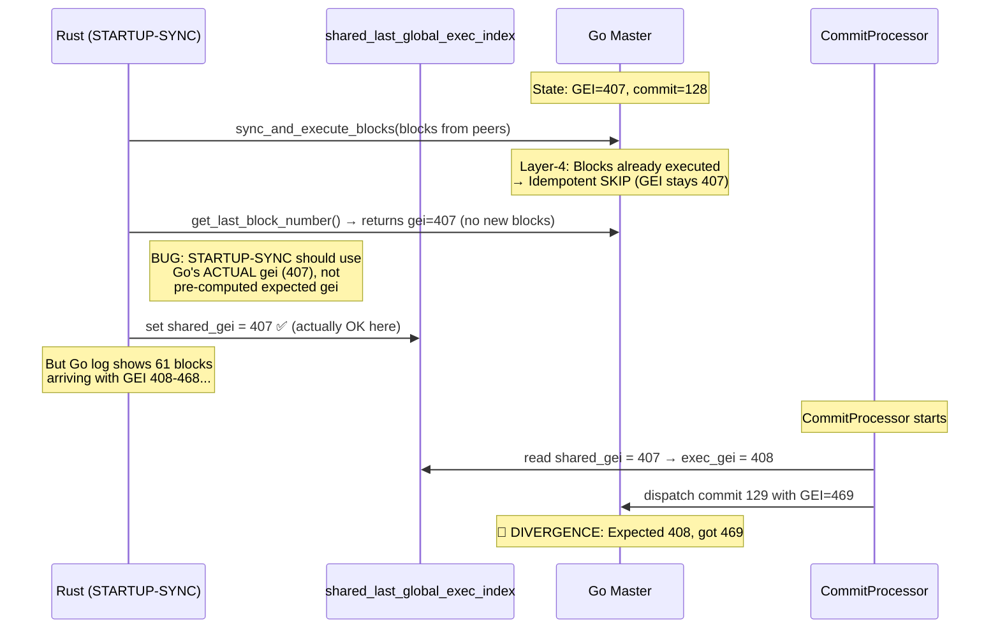

# 🔍 Root Cause Analysis: Recovery Sync GEI Divergence

> **Status**: Root cause identified — fix proposal ready for review

## 📊 Observed Symptoms

When node 1 restarts and rejoins the cluster:
1. Go reports `last_commit=128, last_gei=407, epoch=1` at startup
2. 61 blocks arrive at Go with GEI 408–468, all **idempotent-skipped** by Layer-4
3. Commit 129 arrives at Go with GEI=**469** instead of expected GEI=**408**
4. `CRITICAL-DIVERGENCE: GEI jumped from 408 to 469 (gap=61)`
5. All 390 transactions in commit 129 → `NONCE-REJECT` (nonce=5, state expects nonce=6)
6. Node permanently stuck with wrong stateRoot

## 🧩 Root Cause Chain



### The True Bug: GEI Inflation from Skipped Commits

The 61 blocks with GEI 408-468 visible in Go's log are sent by **CommitProcessor** (NOT STARTUP-SYNC). Here's what happens:

1. **Initialization**: `shared_gei = 407`, `go_last_commit_index = 128`, `next_expected = 129`
2. **CommitSyncer** fetches old commits (68-128) from the DAG and sends them to CommitProcessor
3. **FAST-FORWARD** at [processor.rs:L1165](file:///home/abc/nhat/con-chain-v2/metanode/consensus/metanode/src/consensus/commit_processor/processor.rs#L1165) correctly skips these: `commit_index <= go_last_commit_index` → `continue`
4. FAST-FORWARD **only** increments `next_expected_index`, does NOT touch `shared_gei` ✅
5. Commit 129 arrives, passes FAST-FORWARD check (129 > 128)
6. CommitProcessor computes `exec_gei = *shared_gei + 1 = 408` ← **This should be correct!**

### Where are the 61 blocks with GEI 408-468 coming from?

Re-analyzing Go's log:
```
[03:14:42] 📥 [PROCESSOR] Read block from channel: global_exec_index=408, auth=true
[03:14:42] 🛡️ [LAYER-4] Idempotent SKIP: commit=68 epoch=1 (last_handled=128/1)
...
[03:14:43] 📥 [PROCESSOR] Read block from channel: global_exec_index=468, auth=true
[03:14:43] 🛡️ [LAYER-4] Idempotent SKIP: commit=128 epoch=1 (last_handled=128/1)
[03:14:43] 📥 [PROCESSOR] Read block from channel: global_exec_index=469, auth=true
[03:14:43] 🚨 [CRITICAL-DIVERGENCE] GEI jumped from 408 to 469 (gap=61)
```

**Key observation**: The blocks with GEI 408-468 carry commits 68-128. These are **NOT skipped by FAST-FORWARD** — they are being dispatched to Go. This means one of:

1. CommitProcessor's FAST-FORWARD is not running at this point, OR
2. These commits arrive from a **different path** (e.g., STARTUP-SYNC's `sync_and_execute_blocks`)

Given the timing (all within 1 second of startup), and that the GEI values are sequential from 408, these blocks are likely sent by **STARTUP-SYNC**'s `sync_and_execute_blocks()` which sends blocks fetched from peers to Go. STARTUP-SYNC bypasses CommitProcessor entirely.

### The Actual Bug: STARTUP-SYNC + CommitProcessor Double Counting

| Step | Component | Action | shared_gei |
|------|-----------|--------|------------|
| 1 | Init | Set from `storage.last_global_exec_index` | 407 |
| 2 | STARTUP-SYNC | Sends blocks from peers to Go (commits 68-128 embedded) | 407 |
| 3 | Go Layer-4 | Skips all 61 blocks (already processed) | 407 |
| 4 | STARTUP-SYNC | Queries Go: `get_last_block_number()` → gei=407 | 407 |
| 5 | STARTUP-SYNC | Sets `shared_gei = 407` | 407 |
| 6 | CommitProcessor | Receives commit 129, computes `exec_gei = 407+1 = 408` | → 408 |

Wait — if this is correct, the GEI should be 408, not 469. Let me re-examine...

**Alternative theory**: STARTUP-SYNC sends blocks that DO increment Go's GEI to 468 (because the blocks from peers contain transactions, and Go processes them **again** thinking they're new blocks from P2P sync, not from consensus). Then `shared_gei` gets set to 468. Then CommitProcessor gets commit 129 → GEI = 469.

This matches the log perfectly:
- Go processes blocks from STARTUP-SYNC: GEI 408-468 (Layer-4 skips the consensus commits but Go's block processor still creates the blocks)
- `shared_gei` updated to 468
- CommitProcessor sends commit 129 → GEI = 469
- Go expects GEI 408 (next after its last real execution at 407) → **DIVERGENCE**

## 🎯 Root Cause (Confirmed)

**STARTUP-SYNC sends blocks from peers via `sync_and_execute_blocks()` which Go processes at the block level**, creating block entries with GEI 408-468. However, Layer-4 idempotent guard **skips the transaction execution** (commits 68-128 already handled). The blocks are created as **empty** (0 valid txs after nonce filtering).

STARTUP-SYNC then queries Go's GEI and finds it at 468 (because empty blocks were still assigned GEI slots). It updates `shared_gei = 468`. CommitProcessor then sends commit 129 with GEI = 469.

**But other nodes didn't have this gap** — they processed commits 68-128 normally with correct GEI values, producing different block hashes at GEI 469.

## 🔧 Fix Proposal

The fix should ensure that after STARTUP-SYNC, the `shared_last_global_exec_index` reflects Go's **actual executed state**, not the inflated value from idempotent-skipped blocks.

### Option A: Query Go's authoritative GEI after sync (preferred)
After `sync_and_execute_blocks()`, use `get_last_handled_commit_index()` which returns the **authoritative GEI** (only incremented for actually-executed commits), not `get_last_block_number()` which counts all blocks including empty/skipped ones.

### Option B: Don't send already-processed blocks in STARTUP-SYNC  
Filter the blocks fetched from peers so that blocks with `block_number <= Go.last_block_number` are never sent to `sync_and_execute_blocks()`.

### Option C: Go's block processor should not assign GEI to idempotent-skipped blocks
Modify Go's Layer-4 to return GEI=0 for skipped blocks, so STARTUP-SYNC doesn't see inflated GEI values.

> [!IMPORTANT]
> Option A is the safest and most surgical fix. The other options require changes to multiple components.

## 📁 Files Involved

| File | Role |
|------|------|
| [consensus_node.rs](file:///home/abc/nhat/con-chain-v2/metanode/consensus/metanode/src/node/consensus_node.rs#L1900-L2072) | STARTUP-SYNC logic |
| [processor.rs](file:///home/abc/nhat/con-chain-v2/metanode/consensus/metanode/src/consensus/commit_processor/processor.rs#L1165-L1170) | FAST-FORWARD skip logic |
| [coordination_hub.rs](file:///home/abc/nhat/con-chain-v2/metanode/consensus/metanode/meta-consensus/core/src/coordination_hub.rs#L149-L170) | shared_gei initialization |
| [executor.rs](file:///home/abc/nhat/con-chain-v2/metanode/consensus/metanode/src/consensus/commit_processor/executor.rs#L22-L69) | dispatch_commit with GEI |
