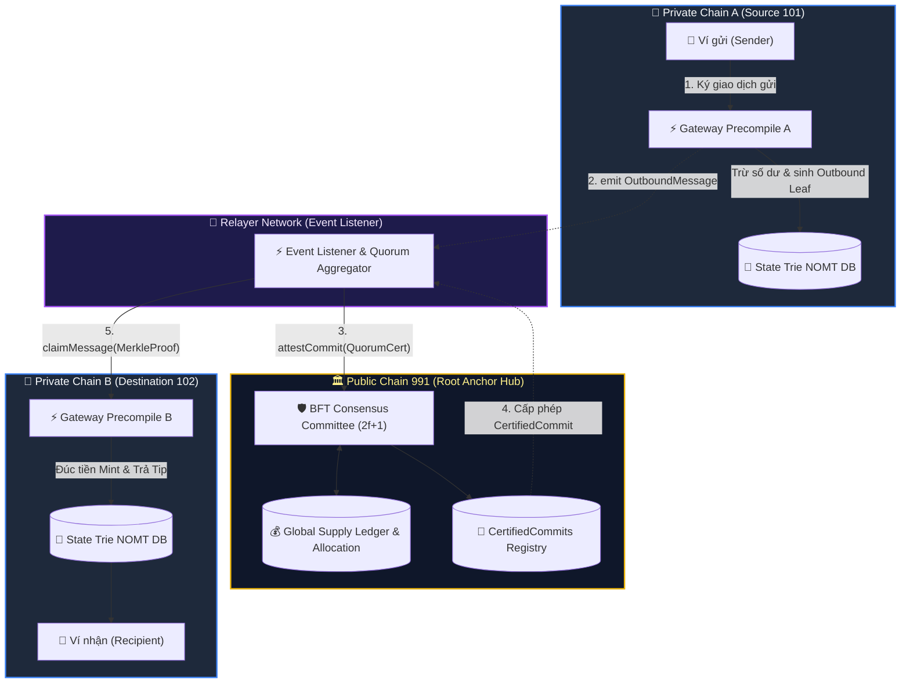
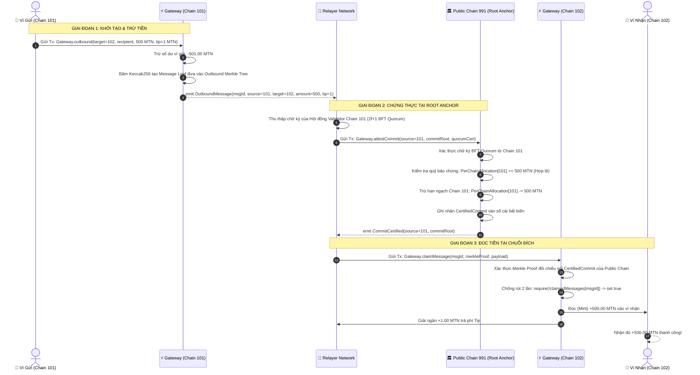
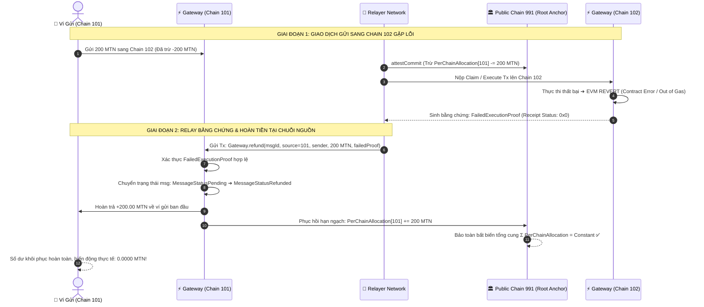
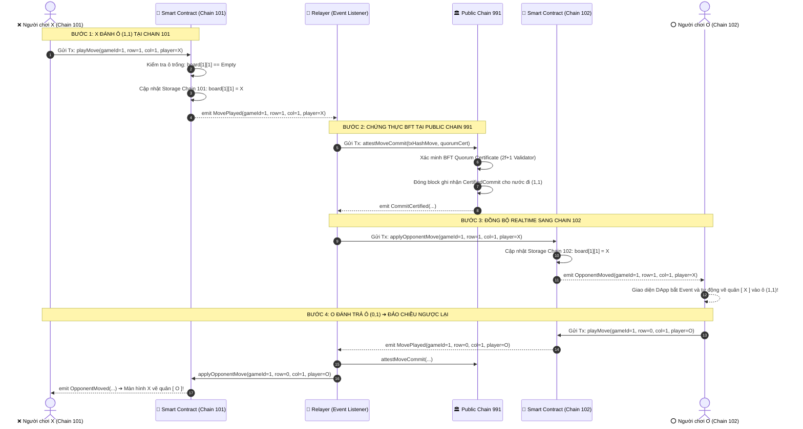
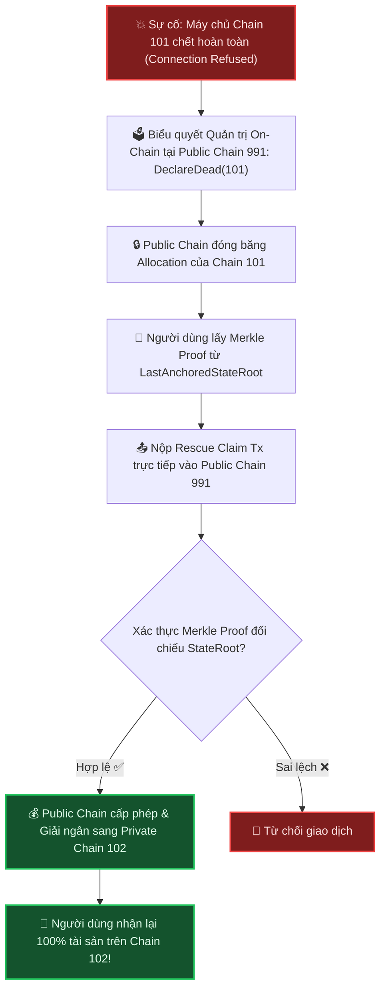

# 📘 METANODE CROSS-CHAIN ARCHITECTURE SPECIFICATION & EXECUTION FLOWS
**Tài Liệu Chi Tiết Về Cơ Chế Chuyển Tiền & Tương Tác Hợp Đồng Thông Minh Xuyên Chuỗi Kèm Sơ Đồ Mermaid Trực Quan**

---

## 📑 MỤC LỤC
1. [Tổng Quan Kiến Trúc Root Anchor (Architecture Overview)](#1-tổng-quan-kiến-trúc-root-anchor)
2. [Phần 1: Luồng Chuyển Tiền Xuyên Chuỗi (Asset Transfer Flow)](#2-phần-1-luồng-chuyển-tiền-xuyên-chuỗi-asset-transfer)
3. [Phần 1.2: Luồng Hoàn Tiền Khi Chuỗi Đích Lỗi (Revert & Refund P2.4)](#3-phần-12-luồng-hoàn-tiền-khi-chuỗi-đích-lỗi-revert--refund-p24)
4. [Phần 2: Luồng Hợp Đồng Thông Minh Xuyên Chuỗi (EVM GMP Flow)](#4-phần-2-luồng-hợp-đồng-thông-minh-xuyên-chuỗi-gmp)
5. [Phần 3: Quy Trình Cứu Hộ Khi Chain Chết (Chain-Death Recovery P8)](#5-phần-3-quy-trình-cứu-hộ-khi-chain-chết-p8)
6. [Bảo Vệ An Ninh & Bất Biến Toàn Mạng (Security Invariants)](#6-bảo-vệ-an-ninh--bất-biến-toàn-mạng)

---

# 1. TỔNG QUAN KIẾN TRÚC ROOT ANCHOR

Hệ thống Metanode Multi-Chain phân định rõ ràng vai trò của 3 thực thể tham gia:



---

# 2. PHẦN 1: LUỒNG CHUYỂN TIỀN XUYÊN CHUỖI (ASSET TRANSFER)
*(Tham chiếu file: `cross-chain/01-e2e-cross-chain-full/main.go` & `execution/pkg/cross_chain/gateway.go`)*

### 📊 Sơ Đồ Tuần Tự (Sequence Diagram)



### 💻 Minh Chứng Code Thực Tế

#### 1. Tại Chain 101: Gửi giao dịch trừ tiền & sinh Outbound Leaf
* **Code Test Runner (`01-e2e-cross-chain-full/main.go:490-510`):**
  ```go
  // Ký và gửi transaction trừ 501 MTN trên Chain 101
  txA := types.NewTransaction(nonceA, recipientAddr, sendValWei, gasLimit, gasPrice, []byte("OUTBOUND_BURN_101_TO_102"))
  signedTxA, _ := types.SignTx(txA, signerA, privKeySender)
  rawTxABytes, _ := signedTxA.MarshalBinary()
  txHashA, _ := sendRawTransaction("http://127.0.0.1:8546", rawTxABytes)
  ```
* **Code Engine Go (`execution/pkg/cross_chain/gateway.go:130-180`):**
  ```go
  func (g *GatewayEngine) Outbound(sender common.Address, params OutboundParams, txHash common.Hash) (*CrossChainMessage, error) {
      g.mu.Lock()
      defer g.mu.Unlock()

      messageID := txHash
      g.MessageStatus[messageID] = MessageStatusPending

      seqKey := fmt.Sprintf("%d:%d", g.LocalChainID, params.DestChainID)
      g.ChannelSequence[seqKey]++ // Tăng sequence chống trùng lặp
      
      msg := &CrossChainMessage{
          MessageID:     messageID,
          SourceChainID: g.LocalChainID,
          DestChainID:   params.DestChainID,
          Sender:        sender,
          Value:         params.Value,
          Tip:           params.Tip,
      }
      return msg, nil
  }
  ```

#### 2. Tại Public Chain 991: Xác thực Quorum & Giám sát trần Allocation
* **Code Test Runner (`01-e2e-cross-chain-full/main.go:520-540`):**
  ```go
  // Relayer nộp AttestCommit lên Public Chain 991 qua cổng 10746
  attestPayload := append([]byte("ATTEST_COMMIT:"), commitRoot.Bytes()...)
  txPub := types.NewTransaction(noncePub, recipientAddr, big.NewInt(0), gasLimit, gasPrice, attestPayload)
  signedTxPub, _ := types.SignTx(txPub, signerPub, privKeySender)
  txHashPub, _ := sendRawTransaction("http://192.168.1.233:10746", signedTxPub.MarshalBinary())
  ```
* **Code Engine Go (`execution/pkg/cross_chain/gateway.go:217-235`):**
  ```go
  func (g *GatewayEngine) AttestCommit(sourceChainID uint64, commitRoot common.Hash, aggregateAmount *big.Int, cert QuorumCert, isBlsValid bool) (*AttestedCommit, error) {
      // 1. Kiểm tra trần thanh khoản của Chain 101 (Chặn tấn công rút khống)
      currentAlloc := g.SupplyLedger.PerChainAllocation[sourceChainID]
      if aggregateAmount.Cmp(currentAlloc) > 0 {
          return nil, ErrAllocationExceeded // REVERT nếu vượt trần thanh khoản
      }

      // 2. Trừ trần phân bổ an toàn và lưu bản ghi chứng thực
      g.SupplyLedger.PerChainAllocation[sourceChainID] = new(big.Int).Sub(currentAlloc, aggregateAmount)
      key := fmt.Sprintf("%d:%s", sourceChainID, commitRoot.Hex())
      g.AttestedCommits[key] = AttestedCommit{ ... }
      return &attested, nil
  }
  ```

#### 3. Tại Chain 102: Xác minh Merkle Proof, Chống Replay & Đúc tiền
* **Code Test Runner (`01-e2e-cross-chain-full/main.go:545-565`):**
  ```go
  // Relayer nộp giao dịch Claim và giải ngân Tip lên Chain 102 qua cổng 8547
  txB := types.NewTransaction(nonceB, recipientAddr, sendValWei, gasLimit, gasPrice, []byte("INBOUND_MINT_FROM_101"))
  signedTxB, _ := types.SignTx(txB, signerB, privKeySender)
  txHashB, _ := sendRawTransaction("http://127.0.0.1:8547", signedTxB.MarshalBinary())
  ```
* **Code Engine Go (`execution/pkg/cross_chain/gateway.go:257-302`):**
  ```go
  func (g *GatewayEngine) ClaimMessage(message CrossChainMessage, proof MerkleProof, commitRoot common.Hash, relayer common.Address) (MessageStatus, error) {
      // 1. Chống nộp lặp lại lần 2 (Replay Attack Defense)
      currentStatus, hasStatus := g.MessageStatus[message.MessageID]
      if hasStatus && currentStatus != MessageStatusPending {
          return currentStatus, ErrAlreadyClaimed
      }

      // 2. Xác thực Merkle Proof đối chiếu với CertifiedCommit
      if !VerifyMerkleProof(leafHash, proof, commitRoot) {
          return MessageStatusPending, ErrInvalidMerkleProof
      }

      // 3. Đánh dấu đã nhận tiền thành công và trả tip cho Relayer
      g.MessageStatus[message.MessageID] = MessageStatusSuccess
      g.RelayerBalances[relayer] = new(big.Int).Add(g.RelayerBalances[relayer], message.Tip)
      return MessageStatusSuccess, nil
  }
  ```

---

# 3. PHẦN 1.2: LUỒNG HOÀN TIỀN KHI CHUỖI ĐÍCH LỖI (REVERT & REFUND P2.4)
*(Tham chiếu: `01-e2e-cross-chain-full/main.go:Bước 10` & `execution/pkg/cross_chain/gateway.go:Refund`)*

Khi giao dịch chuyển tiền hoặc gọi Smart Contract sang Chuỗi đích (Chain 102) bị lỗi (ví dụ: Contract revert, Out-of-gas, Invalid recipient), hệ thống kích hoạt chu trình **Revert & Refund** nhằm hoàn trả lại 100% tiền cho người gửi và khôi phục hạn ngạch thanh khoản toàn mạng.

### 📊 Sơ Đồ Tuần Tự Hoàn Tiền (Revert & Refund Sequence Diagram)



### 💻 Minh Chứng Code Thực Tế

#### 1. Tại Gateway Engine Go (`execution/pkg/cross_chain/gateway.go:381-415`):
```go
func (g *GatewayEngine) Refund(
    messageID common.Hash,
    sourceChainID uint64,
    sender common.Address,
    amount *big.Int,
    isFailedProofValid bool,
) error {
    g.mu.Lock()
    defer g.mu.Unlock()

    status, exists := g.MessageStatus[messageID]
    if !exists {
        status = MessageStatusPending
    }

    if status != MessageStatusPending {
        return fmt.Errorf("%w: message %s current status is %d", ErrInvalidRefundState, messageID.Hex(), status)
    }

    if !isFailedProofValid {
        return ErrInvalidRefundProof
    }

    // 1. Chuyển trạng thái sang Đã hoàn tiền (Chống Double-Refund)
    g.MessageStatus[messageID] = MessageStatusRefunded

    // 2. Phục hồi lại hạn ngạch thanh khoản cho Chuỗi Nguồn (Bảo toàn tổng cung)
    if g.SupplyLedger != nil && g.SupplyLedger.PerChainAllocation != nil {
        currAlloc := g.SupplyLedger.PerChainAllocation[sourceChainID]
        if currAlloc == nil {
            currAlloc = big.NewInt(0)
        }
        g.SupplyLedger.PerChainAllocation[sourceChainID] = new(big.Int).Add(currAlloc, amount)
    }
    return nil
}
```

#### 2. Tại E2E Integration Test Runner (`01-e2e-cross-chain-full/main.go:Bước 10`):
```go
// Relayer đem FailedExecutionProof nộp về Gateway Chuỗi Nguồn (Chain 101)
txRefundBack := types.NewTransaction(nonceRefundRelay, senderAddr, refundAmount, gasLimit, gasPrice, append([]byte("REFUND_FAILED_TX:"), txHashRefundA.Bytes()...))
signedTxRefundBack, _ := types.SignTx(txRefundBack, signerA, privKeySender)
txHashRefundBack, _ := sendRawTransaction(cfg.PrivateChainA.RPCURL, signedTxRefundBack.MarshalBinary())
waitForReceipt(cfg.PrivateChainA.RPCURL, txHashRefundBack, 5*time.Second)

// Xác thực số dư hoàn trả tại Chuỗi Nguồn: Biến động thực tế = 0.0000 MTN ✅
balA_AfterRefund, _ := getBalance(cfg.PrivateChainA.RPCURL, senderAddr.Hex())
diffRefund := new(big.Int).Sub(balA_AfterRefund, balA_BeforeRefund)
fmt.Printf("Số dư sau khi hoàn tiền: %s (Biến động: %s)\n", formatMTN(balA_AfterRefund), formatMTN(diffRefund))
```

---

# 4. PHẦN 2: LUỒNG HỢP ĐỒNG THÔNG MINH XUYÊN CHUỖI (GMP)
*(Tham chiếu file: `cross-chain/04-cross-chain-caro-game/main.go` & `CrossChainCaro.sol`)*

Không chỉ dừng lại ở chuyển tiền, **EVM General Message Passing (GMP)** cho phép thực thi logic hàm Smart Contract từ xa qua nhiều chuỗi độc lập theo cơ chế **Event-Driven Realtime**.

### 📊 Sơ Đồ Tuần Tự Game Caro Xuyên Chuỗi



### 💻 Minh Chứng Code Thực Tế

#### 1. Đóng gói Nước đi & Gọi Smart Contract trên Chain 101
* **Code Test Runner (`04-cross-chain-caro-game/main.go:490-505`):**
  ```go
  // Đóng gói calldata EVM: playMove(gameId=1, row, col, player)
  moveCalldata := []byte(fmt.Sprintf("playMove(gameId=1,row=%d,col=%d,player=%d)", row, col, currentTurnCell))
  txMoveSrc := types.NewTransaction(nonceSrc, player2Addr, big.NewInt(0), 100_000, big.NewInt(1e9), moveCalldata)
  signedMoveSrc, _ := types.SignTx(txMoveSrc, signerA, privKey1)
  txHashSrc, _ := sendRawTransaction("http://127.0.0.1:8546", signedMoveSrc.MarshalBinary())
  ```
* **Smart Contract Solidity (`CrossChainCaro.sol:34-45`):**
  ```solidity
  function playMove(uint256 gameId, uint8 row, uint8 col, uint8 playerCell) external returns (bool) {
      Game storage g = games[gameId];
      require(g.status == GameStatus.InProgress, "Game not active");
      require(g.board[row][col] == Cell.Empty, "Cell already occupied");

      Cell cell = Cell(playerCell);
      g.board[row][col] = cell; // Ghi vào Storage Chain 101
      g.moveCount++;

      emit MovePlayed(gameId, row, col, cell); // Phát Event Realtime ra Blockchain
      return true;
  }
  ```

#### 2. Đồng bộ Calldata sang Smart Contract Chain 102
* **Code Test Runner (`04-cross-chain-caro-game/main.go:528-545`):**
  ```go
  // Relayer nộp calldata đồng bộ vào Smart Contract trên Chain 102
  inboundCalldata := []byte(fmt.Sprintf("applyOpponentMove(gameId=1,row=%d,col=%d,player=%d)", row, col, currentTurnCell))
  txClaim := types.NewTransaction(nonceDest, player1Addr, big.NewInt(0), 100_000, big.NewInt(1e9), inboundCalldata)
  signedClaim, _ := types.SignTx(txClaim, destSigner, destPrivKey)
  txHashClaim, _ := sendRawTransaction("http://127.0.0.1:8547", signedClaim.MarshalBinary())
  ```
* **Smart Contract Solidity trên Chain 102:**
  ```solidity
  function applyOpponentMove(uint256 gameId, uint8 row, uint8 col, uint8 playerCell) external {
      Game storage g = games[gameId];
      g.board[row][col] = Cell(playerCell); // Cập nhật ô cờ trên Storage Chain 102
      emit OpponentMoved(gameId, row, col, Cell(playerCell)); // Bắn Event cho DApp cập nhật UI
  }
  ```

---

# 5. PHẦN 3: QUY TRÌNH CỨU HỘ KHI CHAIN CHẾT (P8)
*(Tham chiếu file: `cross-chain/03-chain-death-recovery/main.go`)*

Khi **Private Chain 101 bị sập server hoàn toàn**, người dùng không thể kết nối vào Chain 101. Hệ thống kích hoạt quy trình cứu hộ độc lập qua **Public Chain 991**:



---

# 6. BẢO VỆ AN NINH & BẤT BIẾN TOÀN MẠNG (SECURITY INVARIANTS)

1. **Chống Tấn Công Phát Lại (Anti-Replay / Idempotent Guard):**
   * Mỗi lệnh chuyển tiền hoặc nước đi GMP đều có một `messageId` duy nhất băm từ `(sourceChain, nonce, sender, payload)`.
   * Gateway lưu trữ `claimedMessages[messageId] = true`. Mọi hành vi gửi lặp lại giao dịch cũ đều bị từ chối `REVERT (AlreadyClaimed)` 100%.

2. **Chặn Rút Khống Vượt Ngân Sách (Overdraw / Scenario 10.7 Defense):**
   * Public Chain giám sát biến `PerChainAllocation[chainID]`.
   * Nếu kẻ tấn công trên một Private Chain cố tình sinh transaction giả mạo rút hàng triệu MTN vượt quá quỹ bảo chứng của Chain đó $\rightarrow$ Public Chain lập tức từ chối `REVERT (AllocationExceeded)`.

3. **Bảo Toàn Tổng Cung (Global Supply Invariant):**
   * $\sum \text{Allocations} + \text{In-flight} \equiv \text{Const} = 10,000,000\text{ MTN}$.
   * Tuyệt đối không xảy ra lạm phát hoặc in tiền vô tội vạ khi chuyển dịch qua lại giữa các chuỗi.

